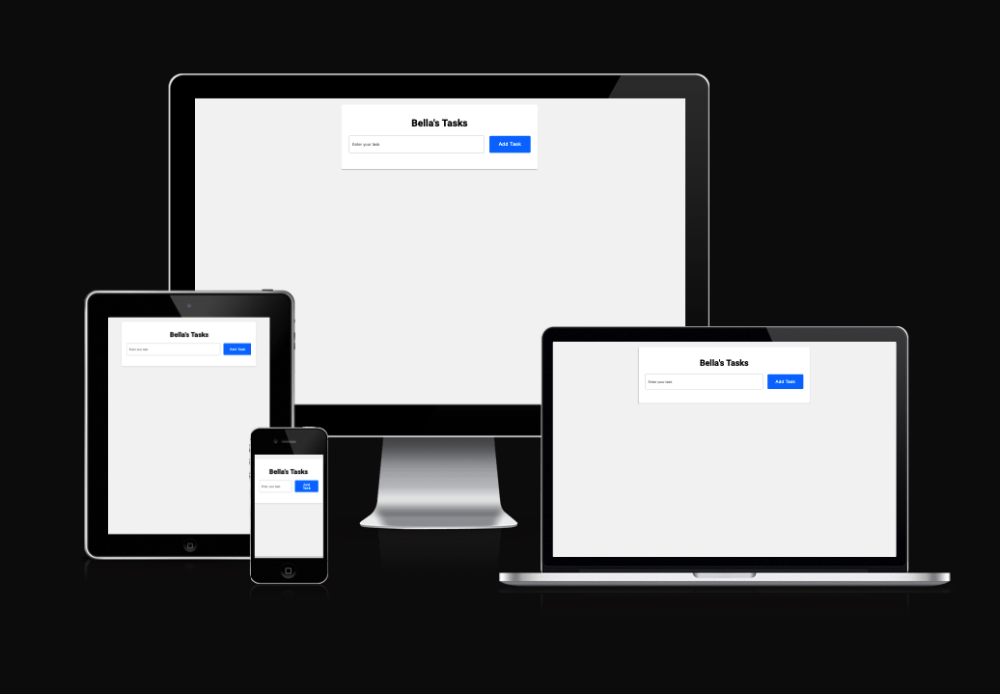
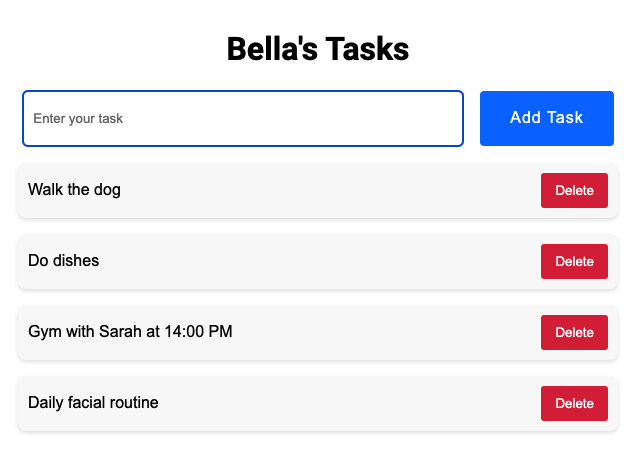
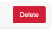
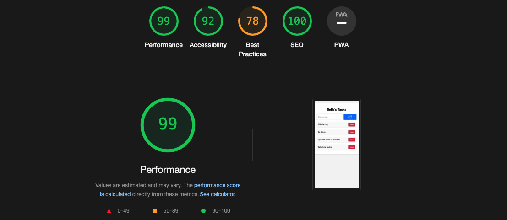
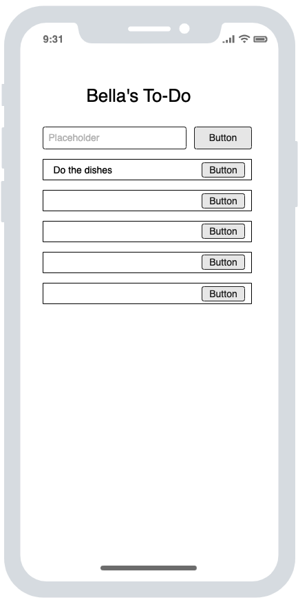

# Bella's To Do App
Bella's To Do App is a responsive to-do list application built using JavaScript, HTML, and CSS. The app is designed to help you manage your tasks effectively. It allows you to create and organize a to-do list, add new tasks, and remove tasks once they are completed. The tasks are saved permanently using local storage, ensuring your list is preserved even if you close the app.

## Design

The design of Bellas To Do App prioritizes simplicity and ease of use. The user interface is clean and straightforward, focusing on the core functionality of adding and removing tasks from a list. 

- **Minimalistic Layout:** The app uses a minimalist layout to keep the focus on the tasks at hand, avoiding unnecessary distractions.
- **Intuitive Controls:** Users can easily interact with the app thanks to the clear and intuitive controls. Buttons are clearly labeled and strategically placed for convenient access.
- **Responsive Design:** The app's design is responsive, ensuring a consistent experience across various devices, including desktops, tablets, and smartphones.
- **Color Scheme:** The color scheme is simple and unobtrusive, aiming to create a comfortable environment for task management.

Overall, the design complements the functionality of the app, providing users with an efficient and user-friendly task management tool."

## Features

- **Create and Manage Lists:** Easily create and manage your to-do list.
- **Add Tasks:** Quickly add new tasks to your list.
- **Remove Tasks:** Remove tasks from your list when completed.
- **Persistent Storage:** Tasks are stored using local storage, so your data is saved even if you close the app.
- **Responsive Design:** The app is fully responsive and can be used comfortably on various devices, including desktops, tablets, and smartphones.

## How to Use

1. **Create a List:** Start by creating a new list in the app.
2. **Add Tasks:** Add tasks to your list using the input field.
3. **Remove Tasks:** Once a task is completed, remove it from your list.

**Add and Remove Tasks**

    Users can add tasks to their list by entering a task in the input field and clicking the appropriate button. Once a task is completed or no longer needed, it can be removed from the list to keep the list organized and up to date.

**Delete Tasks**

    Users can delete tasks from their list once they are completed or no longer needed. This helps keep the list clean and focused on active tasks. 

**Persistent Storage**

    The app uses local storage to save tasks permanently, so users can access their lists even after closing the app.

**Responsive Design**

    The app is fully responsive, allowing it to be used on various devices including desktops, tablets, and smartphones. The layout adjusts according to screen size for an optimal experience.

## Testings ##
The app provides a seamless user experience, allowing users to efficiently manage their tasks. It functions as intended, enabling users to add new tasks, remove completed or unnecessary tasks, and permanently save their list for later access. All buttons are fully functional, offering users an intuitive way to interact with the app and maintain an organized list of tasks. The responsive design ensures a consistent experience across different devices, making the app easy to use whether on a desktop, tablet, or smartphone.

## Validator Testings ##

- JS
   - No real errors returned when passing through the official [JS Lint](https://www.jslint.com/)

- HTML
   - No real errors returned when passing through the official [W3C Validator](https://validator.w3.org/nu/?doc=https%3A%2F%2Fannabellaals.github.io%2Fbella-todo-app%2F)

- CSS
  - No real errors were found when passing through the official [(Jigsaw) Validator](https://jigsaw.w3.org/css-validator/validator)

## Unfixed Bugs ##

  None found.

### Deployment

The site is deployed using GitHub Pages - [Bella's To Do](https://annabellaals.github.io/bella-todo-app/).

To Deploy the site using GitHub Pages:

1. Login (or signup) to Github.
2. Go to the repository for this project, [annabellaals/bella-todo-app](https://github.com/annabellaals/bella-todo-app).
3. Click the settings button.
4. Select pages in the left hand navigation menu.
5. From the source dropdown select main branch and press save.
6. The site has now been deployed, please note that this process may take a few minutes before the site goes live.

### Local Development

#### How to Fork

To fork the repository:

1. Log in (or sign up) to Github.
2. Go to the repository for this project, [annabellaals/bella-todo-app](https://github.com/annabellaals/bella-todo-app)
3. Click the Fork button in the top right corner.

#### How to Clone

To clone the repository:

1. Log in (or sign up) to GitHub.
2. Go to the repository for this project, [annabellaals/bella-todo-app](https://github.com/annabellaals/bella-todo-app)
3. Click on the code button, select whether you would like to clone with HTTPS, SSH or GitHub CLI and copy the link shown.
4. Open the terminal in your code editor and change the current working directory to the location you want to use for the cloned directory.
5. Type 'git clone' into the terminal and then paste the link you copied in step 3. Press enter.

## Credits
* Credits to Code Institude, tasks taught me a lot on how to put things together. Help from mentor, and the slack community.

* Credits to Harvard's Online Courses on Youtube on HTML CSS and JS

* Credits to W3schools.

* Credits to Code Institute community, helped me on-hand

## Wireframe

